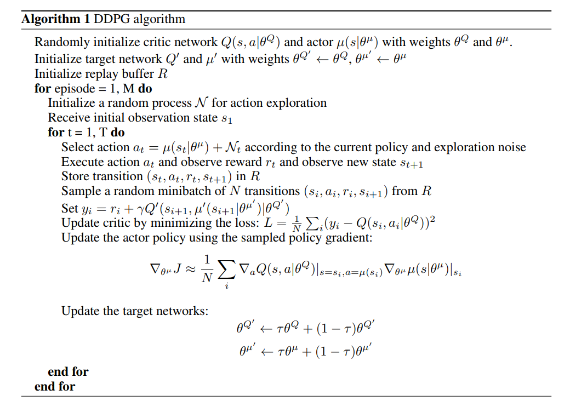
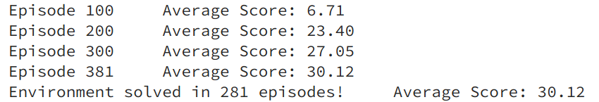
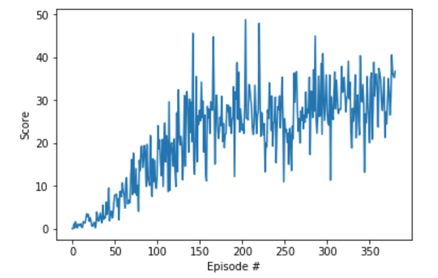

# Implementation description

## Learning algorithm

DDPG agent algorithm with random sample replay buffer is used for the project[2].  
DDPG is a policy gradient algorithm that uses a stochastic behavior policy for exploration but estimates a deterministic target policy. Policy gradient algorithms utilize a form of policy iteration: they evaluate the policy, and then follow the policy gradient to maximize performance. DDPG is off-policy and uses a deterministic target policy, which allows for the use of the Deterministic Policy Gradient. DDPG is an actor-critic algorithm, it uses two neural networks, one for the actor and one for the critic. These networks compute action predictions for the current state and generate a temporal-difference (TD) error signal each time step. The input of the actor network is the current state, and the output is a single real value representing an action chosen from a continuous action space. The critic’s output is the estimated Q-value of the current state and of the action given by the actor. The deterministic policy gradient provides the update rule for the weights of the actor network. The critic network is updated from the gradients obtained from the TD error signal [1].  




For our implementation we have used the following architecture:

* Actor: 512 -> 256 (with dropout=0.2, while training)
* Critic: 512 -> 256 -> 128 (with dropout=0.2, while training)


### Hyperparameters

```python
Config.tau = 1e-3                     # for soft update of target parameters
Config.weight_decay = 0.              # critic L2 weight decay
Config.states = None                  # environment states
Config.state_size = None              # environment state size
Config.action_size = None             # environment action size
Config.lr_actor = 1e-4                # actor agent learning rate
Config.lr_critic = 3e-4               # critic agent learning rate
Config.batch_size = 512               # minibatch size
Config.buffer_size = int(1e6)         # replay buffer size
Config.gamma = 0.99                   # discount factor
Config.update_every = 4               # how often to update the network
```

## Plots for the rewards

The following plots summarises the learning process of the agent through different episodes. The agent took 281 episodes to solve the environment.



## Ideas for future work

Following optimizations can be applied to the project:

- Test and compare Reinforce model
- Implement prioritized replay buffer
- Paramter space noise for better exploration
- Test shared network between agents
- Estimate hyperparameters by training an agent
- Experiment with Generalized Advantage Estimation
- Experiment with A2c and A3C


### Refrences
1. [Deep Deterministic Policy Gradients in TensorFlow](https://pemami4911.github.io/blog/2016/08/21/ddpg-rl.html)
2. [Continuous control with deep reinforcement learning](https://arxiv.org/abs/1509.02971)